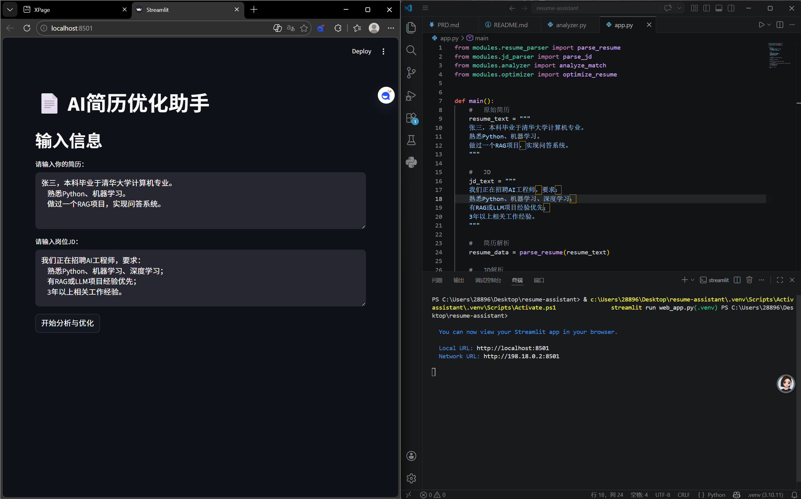
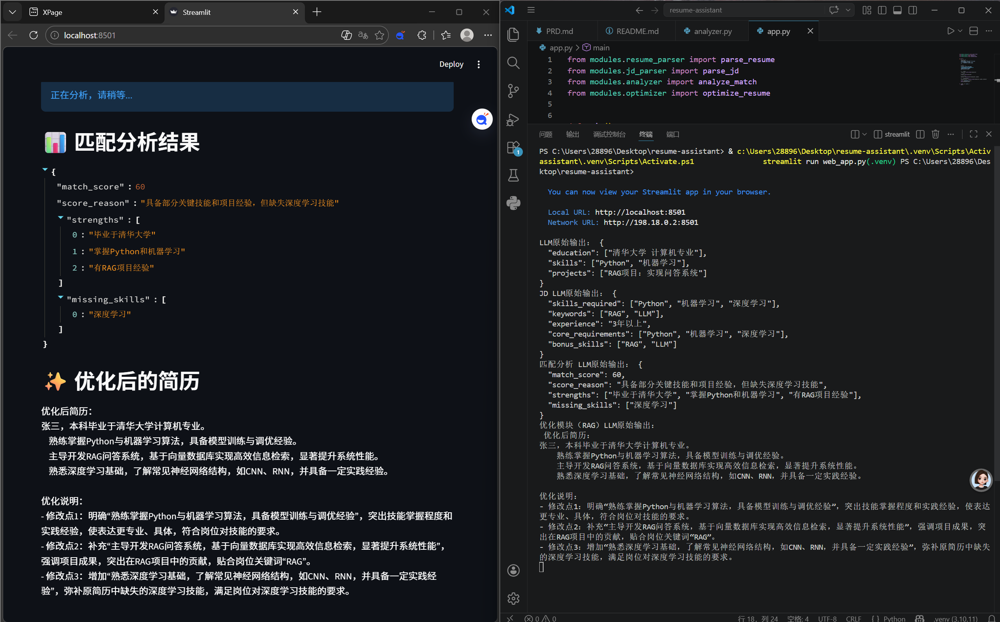

# AI Resume Optimizer（智能简历优化助手）

##   项目简介

AI Resume Optimizer 是一个基于大语言模型（LLM）的简历优化工具，旨在帮助求职者提升简历质量与岗位匹配度。用户只需输入简历文本及目标岗位描述（JD），系统即可自动完成简历解析、岗位理解、人岗匹配分析，并生成优化后的简历内容。

本项目不仅关注“生成结果”，更强调“分析过程”和“结果可信度”，通过结构化解析与可解释机制，帮助用户理解自身优势与不足，从而实现更有效的简历优化。

---

##   解决的问题

在实际求职过程中，简历往往存在以下问题：

- ❌ 缺乏针对性：简历内容未围绕岗位JD进行调整  
- ❌ 表达不专业：描述偏口语化，难以体现能力水平  
- ❌ 信息冗余或缺失：重点不突出，核心能力未被有效呈现  
- ❌ 无法量化成果：缺乏结构化与结果导向表达  

传统修改方式依赖人工经验，成本高且效率低。本项目通过引入AI能力，实现简历优化的自动化与标准化。

---

##   核心功能

### 1. 简历解析（Resume Parsing）
对用户输入的自由文本简历进行结构化解析，提取教育背景、技能列表及项目经验。

### 2. JD解析（Job Description Parsing）
解析岗位描述，提取核心技能要求、关键词及经验要求。

### 3. 匹配分析（Match Analysis）
输出：
- 匹配评分（match_score）
- 优势项（strengths）
- 缺失项（missing_skills）
- 评分原因（score_reason）

### 4. 简历优化（Resume Optimization）
对简历进行优化生成：
- 提升表达专业性  
- 强化岗位相关性  
- 优化结构与重点  

### 5. RAG增强（Retrieval-Augmented Generation）
引入优秀简历案例作为参考知识库，提高生成质量，使输出更接近真实优秀简历表达。

### 6. 内容约束机制（Anti-Hallucination）
防止模型“胡编”：
- 不新增原简历不存在的经历  
- 不编造量化数据（如百分比）  
- 仅优化表达，不改变事实  

---

##   技术方案

- LLM（豆包API）：文本理解与生成  
- Prompt Engineering：控制输出结构与质量  
- RAG（轻量实现）：基于本地案例增强生成  
- Streamlit：构建Web前端界面  

---

##   使用方式

pip install -r requirements.txt  
streamlit run web_app.py  

启动后访问：  
http://localhost:8501  

---

##   Demo展示

###   输入界面

###   输出结果

---

##   项目结构

resume-assistant/  
├── modules/        # 核心功能模块（解析 / 分析 / 优化）  
├── utils/          # 工具函数（LLM / Prompt / RAG）  
├── data/           # 简历案例知识库  
├── web_app.py      # 前端入口（Streamlit）  
├── app.py          # CLI测试入口  
├── PRD.md          # 产品设计文档  
├── requirements.txt  
└── .gitignore  

---

##   关键设计

### 为什么先做匹配分析再优化？
提高优化针对性，并增强系统可解释性，让用户理解“优化依据”。

---

### 为什么引入RAG？
避免LLM生成不稳定，通过优秀案例提供参考标准，提高输出质量。

---

### 如何控制模型幻觉？
通过Prompt约束：
- 禁止编造经历  
- 禁止虚构数据  
- 明确只优化表达  

---

##   后续优化方向

- 支持PDF/Word简历上传  
- 引入向量数据库（FAISS）增强RAG  
- 支持多轮交互优化  
- 提供行业定制模板  

---

##   作者

马林岑